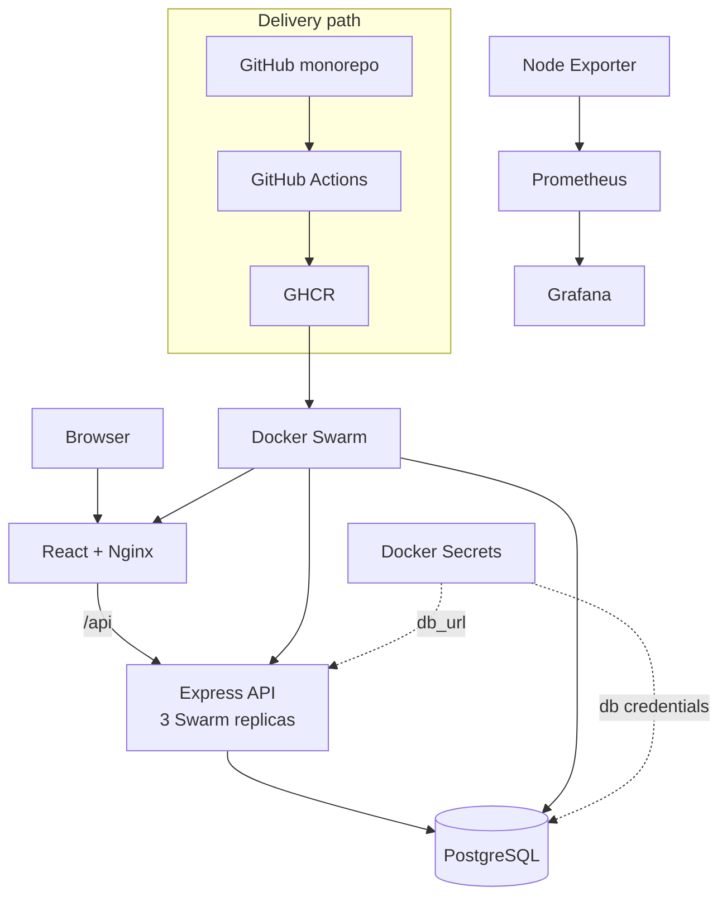

# Architecture

## Repository architecture

The canonical portfolio is organized as one monorepo even though the 2025 implementation was historically split across frontend and backend repositories.

```text
frontend/  -> React UI + Nginx reverse proxy
backend/   -> Express + TypeScript + Prisma CRUD API
infra/     -> local Compose + Docker Swarm + monitoring + secrets
.github/   -> active monorepo CI/CD
workflows/historical/ -> original pipeline evidence
```

## Runtime architecture



## Swarm topology

The assessed lab requirement was **1 manager + 2 workers**. The manager is control-plane only; the canonical stack places workloads on `node.role == worker` and the runbook also recommends manager `drain`.

## Networking

- local development: explicit bridge network `knowhub`
- Swarm: explicit overlay network `internal-net`
- frontend exposes HTTP; Nginx proxies `/api/*` to the backend service
- PostgreSQL remains internal to the service network

The coursework asked for a non-default overlay network, so the canonical stack makes the network explicit instead of relying on an automatically generated default network.

## State

PostgreSQL uses a named volume and Grafana has a persistent data volume. Application containers are otherwise disposable. A local Docker volume on a Swarm worker is node-scoped, so this gives persistence on that node but **not database high availability**.

## Runtime configuration

- Prometheus configuration is non-sensitive and shipped as Docker Config in the Swarm stack.
- PostgreSQL username/password and `DATABASE_URL` are expected as external Docker Secrets.
- No real `.env`, token, Swarm join token, or credential is committed.

## Application boundary

The active backend implements health and post CRUD endpoints. Historical login/register behavior in the frontend is a demo convenience, not a production identity architecture; see `docs/TECHNICAL_DEBT.md`.
