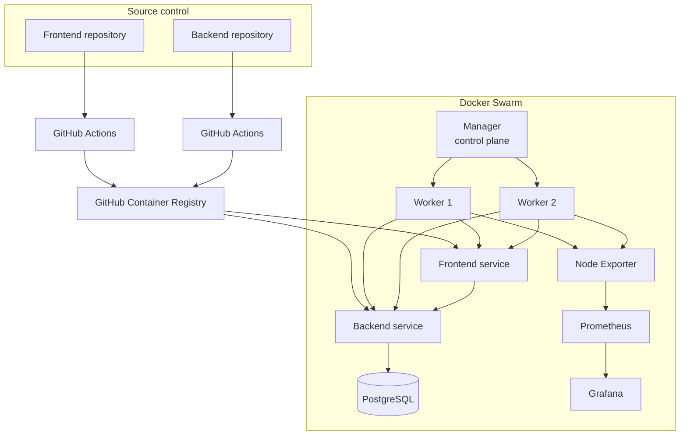

# Architecture

## Scope

KnowHub was a small CRUD-oriented web application used as the workload for a DevOps delivery exercise. The engineering focus was the path from source control to container registry, Swarm deployment, runtime configuration, persistence, and infrastructure monitoring.

## Deployment architecture

## Control plane vs data plane

The manager is responsible for Swarm orchestration and scheduling. The project requirement stated that the manager should not execute application tasks. A production-style stack therefore applies `node.role == worker` placement constraints to workload services.

## Networking

A named custom overlay network is used instead of relying on the implicit default network. This provides a clearer service boundary and predictable service discovery. Public ingress should expose only the minimum required ports; PostgreSQL should stay internal.

## State

- PostgreSQL requires persistent storage.
- Grafana optionally uses a persistent data volume.
- Application containers should remain stateless so replicas can be replaced safely.

Swarm local volumes are node-scoped. This means a single PostgreSQL service backed by a local volume is **persistent but not highly available**.

## Configuration and secrets

Runtime configuration is split conceptually into:

- **Config** — non-sensitive Prometheus configuration and other static runtime configuration.
- **Secret** — database username/password, connection URL, tokens, and credentials.

Secrets should be mounted through `/run/secrets/...` rather than embedded in YAML or committed `.env` files.
