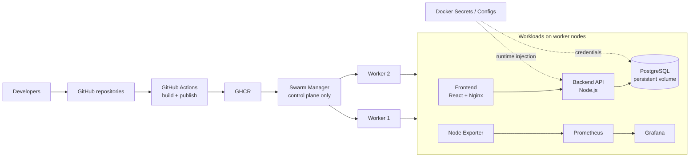

# KnowHub DevOps Platform — CI/CD, Containers & Docker Swarm

> Evidence-based portfolio case study for containerization, GitHub Actions, GHCR, Docker Swarm, secrets/config management, PostgreSQL persistence, and Prometheus/Grafana observability.

**Program:** Final Project DevOps — POROS FILKOM UB  
**Team:** Syifani Adillah Salsabila · Khaelano Abroor Maulana · Muhammad Gathan Raka  
**Portfolio owner:** **Syifani Adillah Salsabila — DevOps Contributor / Frontend & Containerization**  
**Application:** KnowHub community/Q&A web application  
**Original implementation period:** 2025

## Why this repository exists

The original project is spread across a personal development repository and the team organization. This repository is now the **canonical personal portfolio view**: it keeps the frontend development history, explains the final team architecture, links the original source repositories, and separates historical implementation from later hardening recommendations.

The final team project required a web application to be containerized and delivered through **GitHub Actions → GHCR → Docker Swarm**, using at least **1 manager + 2 worker nodes**, custom overlay networking, persistent volumes, Docker Config/Secret, and Prometheus/Grafana monitoring.

## Final system view

> The diagram is a portfolio-level consolidation of the retained final-project artifacts. It does not imply that every service was highly available or production-grade.

## Verified project capabilities

| Area | Evidence retained | Status |
|---|---|---|
| Frontend containerization | Multi-stage Node build → Nginx runtime | **Verified** |
| Backend containerization | Multi-stage Node build, Prisma artifacts, runtime entrypoint | **Verified** |
| GitHub Actions | Frontend and backend image-build/publish workflows | **Verified** |
| Container registry | GHCR used as the target registry | **Verified** |
| Docker Swarm | 1 manager + 2 workers shown in project evidence | **Verified** |
| Worker-only application placement | Project requirement explicitly prohibited manager workloads | **Verified requirement / documented deployment intent** |
| Custom overlay network | `internal-net` / non-default overlay network | **Verified** |
| Persistent state | PostgreSQL volume and Grafana volume | **Verified** |
| Secret handling | External Docker Secrets for database credentials / URL | **Verified** |
| Monitoring | Prometheus + Node Exporter + Grafana | **Verified** |
| Backend scale-out | Application service configured with 3 replicas in retained final config | **Verified configuration** |
| Firebase hosting | Earlier frontend CI/CD path preserved in personal history | **Verified earlier iteration** |

## My verifiable contribution

This was a collaborative team project, not a solo build. My GitHub history provides direct evidence of hands-on contribution to the frontend/DevOps track. In particular, commit `b35193d442a7f5dbd8b0a3c402213ce1f1ee24ed` in this repository is authored by `syifaniads` and introduced Docker configuration, a security-scanning setup, environment handling, and dependency changes. The repository also preserves my earlier branch/PR and Firebase CI/CD work.

The final frontend history was later carried into the team organization. Multiple commits are shared by SHA between the personal repositories and `Final-Project-DevOps/devops-platform-frontend`, which gives the project a traceable provenance rather than a rewritten portfolio-only story.

See [CONTRIBUTIONS.md](CONTRIBUTIONS.md) and [SOURCE_EVIDENCE.md](SOURCE_EVIDENCE.md).

## Important engineering cleanup

The historical project worked as coursework, but several artifacts were not ideal as a senior-reviewable reference. This portfolio therefore documents the gaps instead of hiding them:

- the historical frontend GHCR workflow had an image-name composition issue (`ghcr.io` appeared in both registry and image name);
- branch naming evolved (`main-clean`, `main`, `master`) across repositories;
- the personal `docker-compose.yml` referenced an `api/` directory that is not present on the current default branch;
- the original Swarm example used environment-variable defaults for database credentials, while the final report moved toward Docker Secrets;
- monitoring was infrastructure-level and did not include a mature alerting/SLO stack;
- PostgreSQL used a single stateful instance, so the application tier could scale while the database remained a single point of failure.

Corrected **portfolio reference configurations** are provided under [`infra/`](infra/) and [`examples/ci/`](examples/ci/). These examples are clearly separated from historical evidence.

## Repository map

- [ARCHITECTURE.md](ARCHITECTURE.md) — deployment/control/data-plane architecture
- [CI_CD.md](CI_CD.md) — original pipeline and corrected reference workflow
- [DOCKER_SWARM.md](DOCKER_SWARM.md) — cluster, placement, networking, updates and persistence
- [OBSERVABILITY.md](OBSERVABILITY.md) — Prometheus, Node Exporter and Grafana
- [CONTRIBUTIONS.md](CONTRIBUTIONS.md) — team attribution and my direct evidence
- [SOURCE_EVIDENCE.md](SOURCE_EVIDENCE.md) — original repos, commit lineage and report mapping
- [SECURITY.md](SECURITY.md) — secret handling and public-repository policy
- [RUNBOOK.md](RUNBOOK.md) — reproducible deployment/runbook outline
- [LIMITATIONS.md](LIMITATIONS.md) — evidence and architecture limitations
- [PORTFOLIO.md](PORTFOLIO.md) — CV/website-ready project copy
- [docs/REPOSITORY_PROVENANCE.md](docs/REPOSITORY_PROVENANCE.md) — why multiple repos existed
- [docs/PRODUCTION_HARDENING.md](docs/PRODUCTION_HARDENING.md) — what I would change for production

## Original team source

The final team implementation is preserved in the `Final-Project-DevOps` organization:

- Frontend: https://github.com/Final-Project-DevOps/devops-platform-frontend
- Backend: https://github.com/Final-Project-DevOps/devops-platform-backend
- Infrastructure consolidation: https://github.com/Final-Project-DevOps/infrastructure

The older personal repository `syifaniads/tes` is a duplicate/mirror lineage of the same frontend work and is **not** the canonical portfolio repository anymore.

## Public repository policy

No real GHCR tokens, Firebase tokens, database passwords, `.env` files, private keys, or historical deployment credentials should be committed here. Examples use placeholders or Docker Secrets. The original PDF report is not republished because portfolio evidence is better represented by source history and sanitized documentation.
