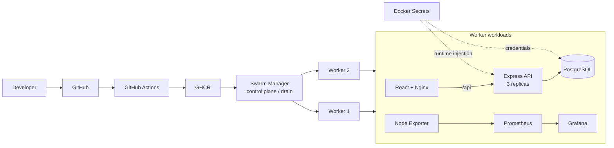

# KnowHub DevOps Platform

> A self-contained DevOps portfolio monorepo covering the application, containerization, CI/CD, Docker Swarm orchestration, runtime secrets, persistence, and observability.

**Program:** Final Project DevOps — POROS FILKOM UB  
**Team:** Syifani Adillah Salsabila · Khaelano Abroor Maulana · Muhammad Gathan Raka  
**Portfolio owner:** **Syifani Adillah Salsabila — DevOps Contributor / Frontend & Containerization**  
**Original implementation:** March 2025


<p align="center">
  
</p>

> **Visual provenance:** the diagram above is derived from the active repository artifacts (`.github/workflows/`, `infra/docker-stack.yml`, `frontend/`, `backend/`, and Prometheus configuration). It is an implementation map, not a fabricated production screenshot.

## Senior technical review path

A reviewer can validate the engineering story directly from the repository:

| Question | Inspect |
|---|---|
| How are images built and published? | [`.github/workflows/publish-images.yml`](.github/workflows/publish-images.yml) |
| How is local runtime composed? | [`infra/docker-compose.yml`](infra/docker-compose.yml) |
| How is Swarm scheduling expressed? | [`infra/docker-stack.yml`](infra/docker-stack.yml) |
| How are secrets handled? | [`infra/secrets/README.md`](infra/secrets/README.md) |
| How is deployment validated? | [`infra/swarm/DEPLOYMENT.md`](infra/swarm/DEPLOYMENT.md) and [`RUNBOOK.md`](RUNBOOK.md) |
| What is actually monitored? | [`OBSERVABILITY.md`](OBSERVABILITY.md) and [`infra/prometheus/prometheus.yml`](infra/prometheus/prometheus.yml) |
| What would need hardening for production? | [`docs/PRODUCTION_HARDENING.md`](docs/PRODUCTION_HARDENING.md) and [`docs/TECHNICAL_DEBT.md`](docs/TECHNICAL_DEBT.md) |
| What is historically verified vs reconstructed? | [`SOURCE_EVIDENCE.md`](SOURCE_EVIDENCE.md) and [`CONTRIBUTIONS.md`](CONTRIBUTIONS.md) |

## What is in this repository?

This repository is the **canonical personal portfolio copy** of the KnowHub final project. It now contains the application and delivery stack together, so a reviewer does not need to jump between the historical frontend, backend, and infrastructure repositories.

```text
.
├── frontend/                  React UI + Nginx image
├── backend/                   Express + TypeScript + Prisma API
├── infra/
│   ├── docker-compose.yml     local multi-container stack
│   ├── docker-stack.yml       Docker Swarm deployment
│   ├── prometheus/            monitoring configuration
│   ├── secrets/               secret bootstrap documentation
│   └── swarm/                 cluster/deployment runbook
├── .github/workflows/         current canonical CI/CD
├── workflows/historical/      original 2025 workflows, retained as evidence
└── docs/                      provenance, hardening, and technical debt
```

## System architecture



## Application path

The retained application is a small community/Q&A CRUD system. The frontend calls `/api/posts`; Nginx proxies that path to the backend. The backend exposes health and post CRUD endpoints and persists posts through Prisma/PostgreSQL.

| Component | Technology | Purpose |
|---|---|---|
| Frontend | React, Nginx | UI and reverse proxy |
| Backend | Node.js, Express, TypeScript | REST API |
| Data | Prisma, PostgreSQL | persistence |
| Build | Docker multi-stage images | reproducible packaging |
| Registry | GHCR | image publication |
| Orchestration | Docker Swarm | multi-node deployment |
| Secrets | Docker Secrets | database runtime credentials |
| Network | custom overlay | service communication |
| Monitoring | Node Exporter, Prometheus, Grafana | host metrics and dashboards |

## Verified historical evidence

The final report documents Dockerfiles for frontend/backend, GitHub Actions image publication, a 1-manager/2-worker Swarm, Docker Secrets/Config, a custom overlay network, persistent volumes, and Prometheus/Grafana monitoring. The original team repositories remain linked in [SOURCE_EVIDENCE.md](SOURCE_EVIDENCE.md).

My direct Git history also includes commit `b35193d442a7f5dbd8b0a3c402213ce1f1ee24ed`, authored by `syifaniads`, which introduced Docker/security/environment work in the personal development lineage. See [CONTRIBUTIONS.md](CONTRIBUTIONS.md).

## Historical vs canonical files

The files under `workflows/historical/` preserve the original 2025 workflow shape for provenance. The active files in `.github/workflows/` are cleaned monorepo equivalents. Likewise, `infra/docker-stack.yml` keeps the original Swarm intent while removing hard-coded environment-specific values.

This distinction matters: the portfolio does **not** silently rewrite history and then claim the improved version was the exact 2025 submission.

## Run locally

```bash
cp .env.example .env
docker compose -f infra/docker-compose.yml up --build
```

Then open:

- application: `http://localhost:8081`
- backend health: `http://localhost:8080/health`
- Prometheus: `http://localhost:9090`
- Grafana: `http://localhost:3000`

## Deploy to Docker Swarm

Read [infra/swarm/DEPLOYMENT.md](infra/swarm/DEPLOYMENT.md). The portfolio stack intentionally keeps the manager in `drain`, schedules workload services on workers, uses an explicit overlay network, and expects external Docker Secrets.

## Engineering caveats

This was a learning/recruitment project, not a production platform. PostgreSQL is a single stateful replica, the historical login/register demo used client-side local storage, and the original pipelines did not implement every production-grade security gate. See [LIMITATIONS.md](LIMITATIONS.md) and [docs/PRODUCTION_HARDENING.md](docs/PRODUCTION_HARDENING.md).

## Source provenance

Original project sources are preserved at:

- `Final-Project-DevOps/devops-platform-frontend`
- `Final-Project-DevOps/devops-platform-backend`
- `Final-Project-DevOps/infrastructure` (later consolidated infrastructure documentation)
- `syifaniads/react-firebase-devops` historical branches and commits

This repository is a curated consolidation of collaborative work. It does not claim sole authorship of team-level backend, Swarm, monitoring, or infrastructure work.
